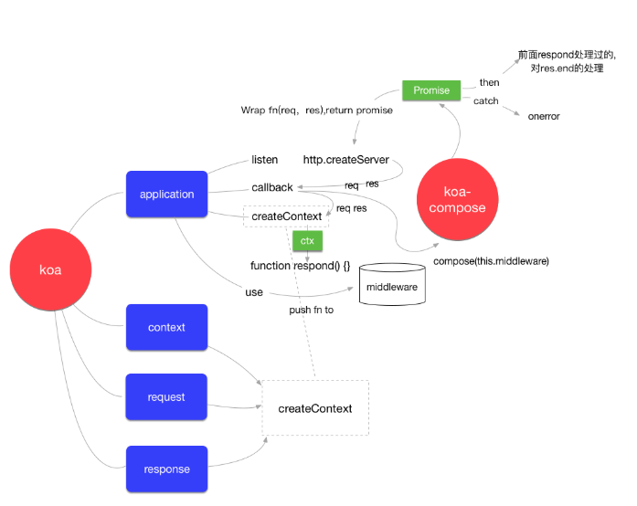

# mini-koa

> 逐步实现一个简单的koa，了解下核心原理：ctx 和 middleware 

## 准备
demo地址：https://github.com/MBearo/mini-koa/tree/main

想要理解demo，需要首先知道

* js基础
* ES6 语法
* node基础

## 尝试官方demo

既然要自己动手实现，首先得弄明白官方的实现。

也不必要一行一行源码看，可以先总结一下怎么使用，通过现象分析本质。

```javascript
const Koa = require('koa');
const app = new Koa();
 
app.use((ctx, next) => {
  ctx.body = 'Hello World';
});
app.listen(3000, () => {
  console.log('server start 3000');
});
```

分析一下可知：

1. koa包导出的是一个类
2. 实例上有 use listen 方法
3. listen 的使用有点像http.createServer
4. use的回调两个参数没见过，但是 ctx 和 req res有点像。中间件可以一次调用，估计和 next 有关系

## 看下官方的文件结构

看包先看package.json

```json
"main": "lib/application.js"
```

那我们就看下lib下有啥

就四个文件：

1. application.js
2. context.js
3. request.js
4. response.js
美滋滋，䁖一眼application

果然，和上文的猜测一样

## 实现listen方法

```javascript
const http = require('http')

class Koa {
  handleRequest (req, res) {
   res.end('hello world')
  }
  listen (...args) {
    const server = http.createServer(this.handleRequest.bind(this))
    server.listen(...args)
  }
}

module.exports = Koa
```

## 实现use方法

这个算是一个核心，先简单实现下

```javascript
//...
  constructor () {
    this.middlewares = []
  }
  use (fn) {
    this.middlewares.push(fn)
  }
//...
```

## 实现ctx对象

先看一下官方的ctx上都挂着什么

```javascript
app.use((ctx, next) => {

  console.log(ctx.req.url);
  console.log(ctx.request.req.url);
  console.log(ctx.response.req.url);
  console.log(ctx.url);
  console.log(ctx.request.req.url);

  ctx.body = 'Hello World';
});
```

看起来是ctx一顿操作就是把 req 和 res 两个对象合并了，加了一些 get 和 set 操作。

官方把 ctx req res 相关的都给拎出来了 放到了单独文件里

尝试实现下

```javascript
const http = require('http');
const context = require('./context');
const request = require('./request');
const response = require('./response');

class Koa
  contructor() {
    this.middlewares = [];
    this.context = Object.create(context);
    this.request = Object.create(request);
    this.response = Object.create(response);
  }
  //...
  createContext(req, res) {
    let ctx = this.context;
    ctx.request = this.request;
    ctx.response = this.response;
    ctx.req = ctx.request.req = ctx.response.req = req;
    ctx.res = ctx.response.res = ctx.request.res = res;

    return ctx;
  }
 // ...
}
```

这里有个问题 为什么用 Object.create 给值赋值

简单说是为了防止因为引用传递导致用户可以修改框架的某些属性

另一个问题是这么写是无法实现 ctx.url 和  ctx.body 等类似这种操作

继续搞下

## 使request可以获取req的值

```javascript
const url = require('url');

// 给 url 添加 getter
const request = {
  get url() {
    return this.req.url;
  }
};

module.exports = request;
```

## 使response可以设置和获取res的值

```javascript
// 给 body 添加 getter 和 setter
const response = {
  get body() {
    return this._body;
  },
  set body(val) {
    // 只要给 body 赋值就代表响应成功
    this.status = 200;
    this._body = val;
  }
};

module.exports = response;
```

## ctx代理res req

```javascript
const context = {};

function defineGetter(property, key) {
  context.__defineGetter__(key, function () {
    return this[property][key];
  });
}

function defineSetter(property, key) {
  context.__defineSetter__(key, function (val) {
    this[property][key] = val;
  });
}

defineGetter('request', 'url');
defineGetter('request', 'path');

defineGetter('response', 'body');
defineSetter('response', 'body');

module.exports = proto;
```

koa的实现是用了个第三方包，那个包里核心的api就是 __defineGetter__ 和 __defineSetter__ 

虽然 __defineGetter__ 和 __defineSetter__ 这俩api已经不推荐使用了，但是好多框架里都是这么实现的

其实Object.defineProperty也可以实现


## 实现中间件的按顺序执行
这个应该算是核心功能

先用官方的尝试一下

```javascript
const Koa = require('koa');
const app = new Koa();

app.use((ctx, next) => {
  console.log(1);
  next();
  console.log(2);
});

app.use((ctx, next) => {
  console.log(3);
  next();
  console.log(4);
});

app.use((ctx, next) => {
  console.log(5);
  next();
  console.log(6);
});

app.listen(3000, () => {
  console.log('server start 3000');
});
```

这里的打印顺序是 1 3 5 6 4 2 

为什么会出现这种现象？当时刚了解koa的时候就很纳闷，这是怎么实现的。特别是异步加上来之后，肯定贼复杂。

后来翻了翻代码，这就是跟大佬们的区别

我们先来尝试非异步的实现


```javascript
class Koa {
//...
  compose(ctx, middles) {
    let dispatch = index => {
      const fn = middles[index];
      return fn(ctx, () => dispatch(++index));
    }
    return dispatch(0);
  }
  handleRequest(req, res) {
    let ctx = this.createContext(req, res);
    this.compose(ctx, this.middlewares);
  }
}

module.exports = Koa;
```

compose来负责把middlewares里的方法串成一串，然后排着执行。

接下来处理下异步方法

```javascript
//...
compose(ctx, middles) {
    let dispatch = index => {
      if (index === middles.length) return Promise.resolve();
      const fn = middles[index];
      return Promise.resolve(fn(ctx, () => dispatch(++index)));
    }
    return dispatch(0); // 默认执行一次
  }
//...
```

## 向客户端返回

分析代码流程的时候有些临界值就可以忽略，比如下面这个方法，完整的判断可以去demo看

```javascript
handleRequest(req, res) {
  let ctx = this.createContext(req, res);

  this.compose(ctx, this.middlewares).then(() => {
    res.end(ctx.body);
  });
```

## 总结

到这里主体流程分析差不多，主要还剩下错误处理，临界值得判断

这篇文章的目的是为了梳理一下koa的实现，比较清晰，骨架出来，然后慢慢往里填

附一张koa原理图


